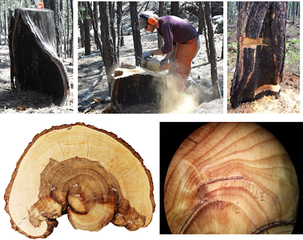

Welcome to the beta version of **TreeFire**, a shiny app for exploring tree-ring fire scar records across North America.

TreeFire accesses the public repository of fire history datasets that are housed on the [International Multiproxy Paleofire Database](https://www.ncei.noaa.gov/products/paleoclimatology/fire-history), a service of NOAA's National Center for Environmental Information (NCEI) and part of the World Data Service for Paleoclimatology (WDS-Paleo). These datasets are contributed by members of the fire history community and enabled by the WDS-Paleo team, and are used here with deep appreciation. Funding for this project was provided by the [US Geological Survey's Community for Data Integration](https://www.usgs.gov/centers/community-for-data-integration-cdi).

TreeFire tools use two open-source R packages, `rIMPD` and `burnr`. Source code for TreeFire is available from <https://github.com/chguiterman/TreeFire>. Further reading on burnr can be found [here](https://doi.org/10.1016/j.dendro.2018.02.005).

**Usage**:

Begin by selecting the **Search the IMPD** tab at the top of this page. You will find a map showing the current extent of North American fire history records available on the IMPD, and to the left, a set of options for filtering this data to select the sites that are of interest to you.

For instance, if you would like to find all fire history sites in Mexico, select "Mexico" from the drop-down menus under "Country or State/Province". Then press "Search" at the bottom of the page.

It may take a few seconds to search the IMPD, depending on your internet connection, and eventually the map will update to show Mexico sites as purple points. The number of records in your selection will be described above the map.

You can choose to **upload a polygon** to the search engine, either as a .kml (Google Earth) file or an ESRIshapefile (making sure to select all necessary files including a .prj).

The **Table** tab will display all of the records in your selection, and provide a button to download the data as a .csv file.

To retrieve the raw tree-ring data (in FHX file format), select the **Retrieve FHX files** tab at the top of the page. A drop down provides a selection of the sites retrieved by your search. You may select one of these to import. This will take a few seconds to download each file from the NCEI server. Once complete, a list of the downloaded files will display at left, proving the study name and number of trees. A button to download the files will generate a .zip folder download containing all of the requested data.

Finally, the **Graphics** tab allows you to make fire history chronology plots of the downloaded FHX data, either individually or in combination. This page is under construction and will change in time.

Thank you for exploring the IMPD and using TreeFire. Any feedback you might have is welcome, by posting issues to the TreeFire repository on GitHub.

Chris Guiterman

